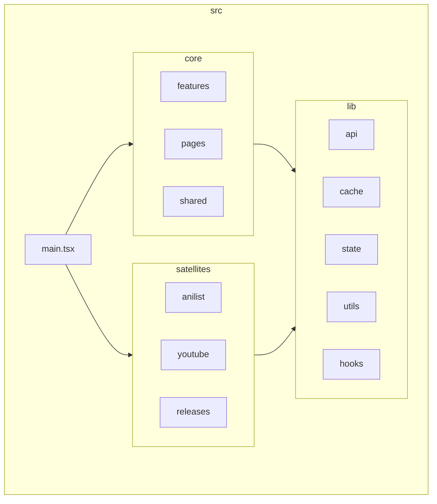

# Project Refactoring Plan: AB-Suite Architecture Overhaul

## 1. Overview

### 1.1. Purpose
This document outlines a comprehensive, phased plan to refactor the AB-Suite userscript. The objective is to evolve the codebase from its current organic structure into a more robust, scalable, and maintainable architecture. This plan is designed to be a complete guide for the development team.

### 1.2. Primary Goals
- **Improve Maintainability**: A developer should be able to understand the project structure and contribute to a new feature with minimal friction.
- **Increase Scalability**: Establish a clear, repeatable pattern for adding new features to the primary host (AnimeBytes) without degrading the architecture.
- **Enhance Developer Experience**: Standardize workflows, reduce boilerplate, and create a clear separation of concerns that makes development faster and less error-prone.
- **Boost Code Quality**: Eliminate systemic code duplication, enforce consistent styling practices, and structure the code to be more testable.

### 1.4. Information regarding this Plan
- Any steps or tasks prefaced with `[USER]`, will require explicit extra information from the user. When the next step is one prefaced like this, make sure to first ask the user on how to handle the step in detail.

---

## 2. Current Architecture: Analysis & Limitations

### 2.1. Structural Overview
The current structure is a hybrid of feature-based and layer-based patterns. While functional, it lacks a clear, guiding philosophy, which has led to several challenges.

**Simplified Current Structure:**
```
src/
├── modules/
│   ├── animebytes/  (Monolithic: contains >95% of features, pages, utils)
│   ├── anilist/     (Minor feature)
│   └── ...          (Other minor features)
├── hooks/           (Mix of generic and feature-specific hooks)
├── services/        (Contains some API logic, but not all)
├── stores/          (Global state management)
├── styles/          (Global stylesheets)
├── types/           (Global, monolithic type definitions)
└── utils/           (Global utility functions)
```

### 2.2. Key Limitations

1.  **Monolithic `animebytes` Module**: The vast majority of the application logic is crammed into `src/modules/animebytes/`. This single module contains dozens of components, hooks, and utilities with no clear internal structure, making it difficult to navigate and understand dependencies.

2.  **Tight Coupling of Concerns**: There is no clear separation between:
    *   **Data Sourcing**: Imperative DOM scraping logic.
    *   **Business Logic**: Data transformation and matching.
    *   **UI Rendering**: Preact components.
    This is most evident in components like `EnhancedCharacterCards.tsx`, which handles all three, making it brittle and difficult to test. A change in the AnimeBytes DOM can require changes deep inside a UI component.

3.  **Inconsistent Patterns**:
    *   **Data Fetching**: `GM_xmlhttpRequest` calls are scattered across `services`, `hooks`, and even components. Caching is implemented inconsistently.
    *   **Styling**: CSS classes are manually prefixed (`ab-`) but lack a strict convention, creating a risk of collision. Styles are not co-located with their components, making it hard to manage dependencies.
    *   **State Management**: The line between local component state (`useState`) and global state (`useSettingsStore`) is not always clear.

---

## 3. Proposed Architecture: "Core + Satellites"

To solve these problems, we will refactor to a **"Core + Satellites"** architecture. This model explicitly acknowledges that AB-Suite is an AnimeBytes-centric application with a few minor, secondary integrations.

### 3.1. New Top-Level Structure



### 3.2. Directory Responsibilities

- **`src/core`**: The heart of the application. Contains all code related to the AnimeBytes integration. It is a self-contained application space.
- **`src/satellites`**: Houses the minor, isolated integrations for other hosts (`anilist`, `youtube`, `releases`).
- **`src/lib`**: Contains truly generic, shared code used by both `core` and `satellites`.
    - `lib/api`: A single, centralized API client wrapping `GM_xmlhttpRequest`.
    - `lib/cache`: Standardized caching utilities.
    - `lib/state`: Global state management (Zustand stores).
    - `lib/utils`: Generic utility functions (e.g., logging).
    - `lib/hooks`: Generic, reusable Preact hooks (e.g., `useAsync`).

### 3.3. Internal Structure of `core/`

- **`core/features`**: Contains the logic and UI for distinct, self-contained enhancements (e.g., `character-cards`, `modern-torrent-table`). These are pure UI and logic, decoupled from the DOM.
- **`core/pages`**: The integration layer. Each file here is an **orchestrator** for a specific page on AnimeBytes (e.g., `characters.ts` for `/characters.php`). Its job is to analyze the page, source the data (by scraping or calling services), and then mount the appropriate feature components, passing them clean data as props.
- **`core/shared`**: For code shared *across features and pages within the AnimeBytes core*.
    - `shared/hooks`: Hooks specific to the AB context (e.g., `useMediaInfo.ts`).
    - `shared/ui`: Standardized UI primitives for AB (e.g., a `Box` component).
    - `shared/utils`: Parsers for AB's specific DOM structure.

---

## 4. Key Technical Changes & Conventions

### 4.1. Styling: UnoCSS
We will adopt **UnoCSS**, the instant on-demand atomic CSS engine, to create a modern, maintainable, and highly efficient styling system. This replaces the manual, co-located CSS approach, eliminating the need for separate `.css` files and context switching.

- **Tooling**: Add `unocss`, `@unocss/preset-wind4` (preset based on TailWindCSS v4), and `@unocss/preset-attributify` as `devDependencies`. (Already done)
- **Configuration**: A `uno.config.ts` file will be created at the project root to configure presets and custom rules. UnoCSS will be integrated directly into the Vite build process.
- **Usage Convention**: We will primarily use **Attributify Mode** for its superior readability within JSX. This keeps markup clean by turning utility classes into props. All styling will be co-located directly within the component's TSX file.
- **Conversion Strategy**: The migration will be incremental. As features are refactored (e.g., `modern-torrent-table` in Phase 4), their associated `.css` files will be deleted, and all styles will be converted to UnoCSS attributes directly on the JSX elements.

**Example:**
- core/features/character-cards/CharacterCard.tsx:
```tsx
// After (with UnoCSS Attributify Mode, no .css file needed)
function CharacterCard() {
  return (
    <div flex bg={someFlag ? "blue" : "yellow"} text={`sm ${someFlag ? "red" : "green"}`}>
      <div flex-shrink="0" p="y-2 x-4">
        
      </div>
      <div p="2">...</div>
    </div>
  );
}

function badExamples() {
  return (
    <p text={`sm ${true ? "red": "green"} ${false ? "right" : "center"}`}></p> 
    // two ternary sections in the template string break the parser and are therefore not allowed. If you need multiple dynamic values for a single property like "text", then use hierarchy and inheritance, or in this simple case simply add commonly used values like text-center and text-right to the safelist in `uno.config.ts`, in which case the above becomes valid and idiomatic again, since the parser does not need to parse the second ternary at all to generate the styles.
    <p text={`${true ? "red": "green"} sm`}></p>
    // this second example also breaks the parser. If you need a ternary template string, then make sure the ternary is at the end of the template string and static values come before it.
  )
}
```
For more complex or reused styles, we will use `shortcuts` in `uno.config.ts` to create custom utilities.

### 4.2. Data Fetching & Caching
All data fetching will be standardized through a central API client.

**`lib/api/index.ts` Example:**
```typescript
import { cacheRequest } from '@/lib/cache';

export interface RequestOptions {
  method?: 'GET' | 'POST' | 'HEAD';
  url: string;
  headers?: Record<string, string>;
  data?: unknown;
  responseType?: 'json' | 'text';
  cache?: {
    key: string;
    ttl: number; // Time to live in milliseconds
  };
}

// This becomes the single point of contact for all external requests.
export function apiRequest<T>(options: RequestOptions): Promise<T> {
  const requestFn = () => new Promise<T>((resolve, reject) => {
    GM_xmlhttpRequest({
      method: options.method || 'GET',
      url: options.url,
      headers: options.headers,
      data: options.data ? JSON.stringify(options.data) : undefined,
      responseType: options.responseType,
      onload: (response) => {
        if (response.status >= 200 && response.status < 300) {
          resolve(response.response);
        } else {
          reject(new Error(`Request failed with status ${response.status}`));
        }
      },
      onerror: () => reject(new Error('Request failed')),
    });
  });

  if (options.cache) {
    return cacheRequest(options.cache.key, requestFn, options.cache.ttl);
  }

  return requestFn();
}
```

### 4.3. Type Definitions
We will move from a monolithic `types` folder to co-located and shared type definitions.

- **Feature-Specific Types**: Defined in `types.ts` inside the feature folder (e.g., `core/features/modern-torrent-table/types.ts`).
- **Shared Core Types**: Defined in `core/shared/types.ts`.
- **Global Library Types**: Defined in `lib/types.ts` (and `lib/userscript.d.ts`)

---

## 5. Phased Implementation Plan

### Phase 1: Foundation & Tooling
*   **Task 1.1: Configure Vite & UnoCSS**: Install `unocss`, `@unocss/preset-wind4`, and `@unocss/preset-attributify`. Create `uno.config.ts` and add the `UnoCSS()` plugin to `vite.config.ts`.

### Phase 2: Centralize Core Services (`lib`)
*   **Task 2.1: Create `src/lib`**: Create `src/lib` and its subdirectories (`api`, `cache`, `state`, `utils`, `hooks`).
[USER]*   **Task 2.2: Move Generic Code**: Move generic files from `src/utils` and `src/hooks` to their new locations in `lib/`. Update all associated import paths.
*   **Task 2.3: Implement `lib/api`**: Create the `apiRequest` function as detailed in section 4.2.
*   **Task 2.4: Refactor API Calls**: Systematically replace all `GM_xmlhttpRequest` calls throughout the codebase with the new `apiRequest` service. This is a critical step to standardize data fetching.
[USER]*   **Task 2.5: Relocate Stores**: Move `src/stores` to `lib/state` and update imports.

### Phase 3: Implement "Core + Satellites" Structure
*   **Task 3.1: Create `src/core` & `src/satellites`**.
[USER]*   **Task 3.2: Move Code**:
    *   Move the contents of `src/modules/animebytes` into `src/core`.
    *   Move `src/modules/anilist`, `youtube`, etc., into `src/satellites`.
[USER]*   **Task 3.3: Update `main.tsx`**: The entry point must be updated to reflect the new structure. The routing logic will now point to orchestrators in `core` and `satellites`.

**`main.tsx` (Conceptual Change):**
```typescript
// Before
import { AnimeBytesHostIntegration } from '@/modules/animebytes';
// ...

// After
import { initializeCore } from '@/core';
import { initializeAnilistSatellite } from '@/satellites/anilist';
// ...

// The main app will delegate initialization based on hostname.
function App() {
  const hostname = window.location.hostname;
  if (hostname === 'animebytes.tv') {
    initializeCore();
  } else if (hostname === 'anilist.co') {
    initializeAnilistSatellite();
  }
  // ...
  return null; // The app is now a logic orchestrator
}
```

### Phase 4: Feature Refactoring (Iterative Case Study: `modern-torrent-table`)
*   **Task 4.1: Create `core` Subdirectories**: Create `core/features`, `core/pages`, and `core/shared`.
*   **Task 4.2: Create Feature Module**: Create `core/features/modern-torrent-table`. Move all related components (`TorrentTable.tsx`, `TorrentRow.tsx`, `TorrentHeader.tsx`, etc.) into this new directory.
*   **Task 4.3: Create Page Orchestrator**: Create `core/pages/search.ts`. This file will contain the logic that was previously in the `useEffect` of the `TorrentTable` component.

**`core/pages/search.ts` (Conceptual Code):**
```typescript
import { render } from 'preact';
import { ModernTorrentTable } from '@/core/features/modern-torrent-table';
import { extractTorrentDataFromDOM } from '@/core/shared/utils/dom-parsers';

export function initializeSearchPage() {
  const originalTable = document.querySelector('#torrent_table');
  if (!originalTable) return;

  // 1. Source the data
  const torrents = extractTorrentDataFromDOM(originalTable);

  // 2. Create a mount point
  const mountPoint = document.createElement('div');
  originalTable.parentNode.replaceChild(mountPoint, originalTable);

  // 3. Render the pure UI component with clean data
  render(<ModernTorrentTable torrents={torrents} />, mountPoint);
}
```
*   **Task 4.4: Refactor Component**: The `ModernTorrentTable` component is now much simpler. It just receives `torrents` as a prop and renders. All DOM-scraping logic is gone.
*   **Task 4.5: Refactor Styling with UnoCSS**: Replace the old CSS classes in the feature's components with UnoCSS attributes. Delete the now-unused `.css` file.
*   **Task 4.6: Co-locate Types**: Move types specific to the torrent table into `core/features/modern-torrent-table/types.ts`.
*   **Task 4.7: Repeat**: Repeat this process for other major features.

### Phase 5: Cleanup & Finalization
*   **Task 5.1: Remove Old Directories**: After all features are migrated, delete the now-empty `src/modules`, `src/hooks`, `src/utils`, and top-level `src/styles` and `src/types` directories.
*   **Task 5.2: Final Review**: Conduct a full code review to ensure:
    *   All imports are correct.
    *   There is no dead code.
    *   No css files are present anymore.
    *   The application builds successfully and all features function as expected.